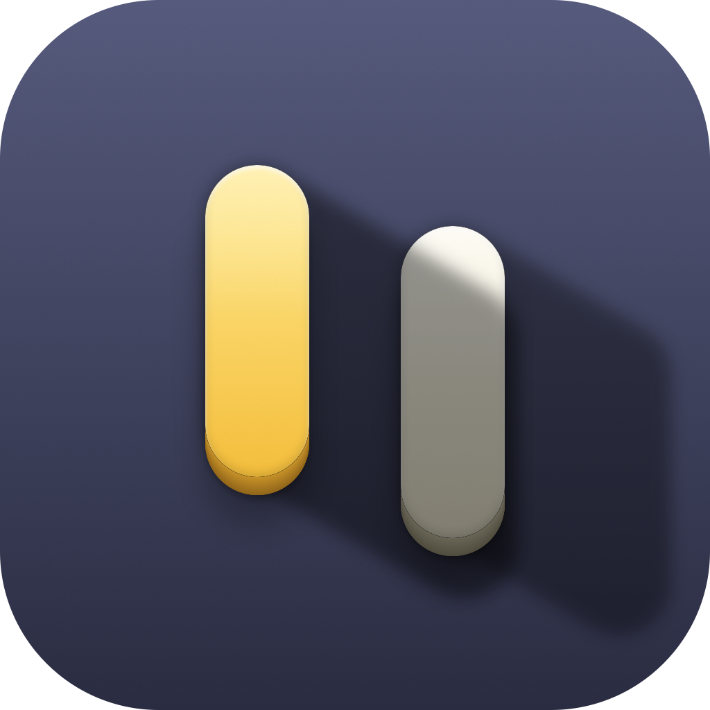
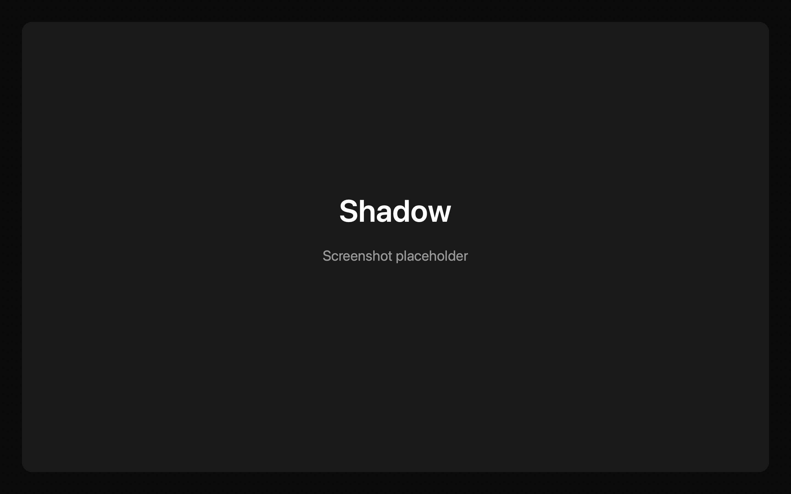

<p align="center">
  
</p>

<h1 align="center">Shadow</h1>

<p align="center">
  <strong>See which node, python and java actually run in each shell, and why.</strong>
</p>

<p align="center">
  <a href="https://github.com/mk24x7/shadow/releases/latest"></a>
  <a href="https://github.com/mk24x7/shadow/actions/workflows/ci.yml"></a>
  
  <a href="LICENSE"></a>
</p>

---

Shadow is a native macOS app, with a companion CLI, that ends the "why is node 18 here" hour.
For every toolchain binary (`node`, `python3`, `ruby`, `java`, `go`, `cargo`, `git` and more)
it shows:

- **the winner**: the copy that actually runs, its version and who installed it;
- **every copy it shadows**, further down PATH or only on some other shell's PATH;
- **the manager** behind each copy: nvm, fnm, Volta, asdf, mise, pyenv, rbenv, jenv, SDKMAN!,
  Conda, Homebrew (including `node@20` style kegs), Python.org, Xcode, macOS and more;
- **the rc-file line that made the winner win**, as `file:line` and the line itself;
- **where shells disagree**: zsh versus bash, login versus interactive, and the PATH that
  Xcode, VS Code and other GUI apps get;
- **findings** such as two version managers fighting over one language, a version file that the
  winner ignores, or a PATH entry that does not exist.

SwiftUI, no Electron, no network access, no telemetry. Shadow is read-only.

<p align="center">
  
</p>

## Install

Shadow is open source and signed with an ad-hoc signature, not an Apple Developer ID.
Pick the install path that suits you.

**1. Homebrew, built from source (no Gatekeeper prompt)**

```bash
brew install mk24x7/tap/shadow
ln -sfn "$(brew --prefix shadow)/Shadow.app" /Applications/Shadow.app
```

This installs the `shadow` CLI and `Shadow.app`. Both are compiled on your Mac, so they carry
no quarantine flag and open without any security dialog. Needs Xcode 15 or later.

**2. Direct download**

Download `Shadow-<version>-macos-universal.dmg` or `.zip` (the app) or
`shadow-<version>-macos-universal.tar.gz` (the CLI) from the
[latest release](https://github.com/mk24x7/shadow/releases/latest), verify it against
`SHA256SUMS.txt`, and copy `Shadow.app` to `/Applications` or `shadow` to a directory on your
PATH. Then either:

- open it once, click **Done** in the "Apple could not verify" dialog, go to
  **System Settings > Privacy & Security**, scroll to **Security** and click
  **Open Anyway** (macOS 15 and 26 no longer offer the Control-click shortcut), or
- clear the quarantine flag from Terminal:

```bash
xattr -d com.apple.quarantine /Applications/Shadow.app
xattr -d com.apple.quarantine /usr/local/bin/shadow   # wherever you put the CLI
```

**3. Homebrew cask (prebuilt, quarantined)**

```bash
brew install --cask mk24x7/tap/shadow-app
```

Homebrew no longer strips quarantine, so this path shows the same first-launch dialog
as the direct download. Use it if you manage your Mac with `brew bundle`.

**4. Build from source**

```bash
git clone https://github.com/mk24x7/shadow.git && cd shadow
./build.sh          # builds dist/Shadow.app and dist/shadow, ad-hoc signed
./package.sh        # optional: zip, dmg, CLI tarball and checksums
```

## What it looks like

An example from a Mac with nvm and Homebrew both providing node:

```
! node
    winner   ~/.nvm/versions/node/v18.20.4/bin/node  18.20.4  nvm (v18.20.4)
    shadowed
      /opt/homebrew/bin/node  22.9.0  Homebrew (node)  -> /opt/homebrew/Cellar/node/22.9.0/bin/node
    because: ~/.zshrc:112 [ -s "$NVM_DIR/nvm.sh" ] && \. "$NVM_DIR/nvm.sh"  (added by nvm init)
    shells
      zsh -l   /opt/homebrew/bin/node
      gui      not found
    [warning] zsh -il runs ~/.nvm/versions/node/v18.20.4/bin/node but zsh -l runs /opt/homebrew/bin/node. ...
    [warning] Apps started from the Dock or Finder (Xcode, VS Code, cron-like agents) run no node, ...
    [warning] ~/work/api/.nvmrc asks for 20, but node reports 18.20.4 (...). nvm switches only when `nvm use` runs.
```

## What it detects

| Kind | Detected |
| --- | --- |
| Version managers | nvm, fnm (including multishell directories), Volta, asdf, mise, pyenv, rbenv, jenv, nodenv, SDKMAN!, rustup, Conda (Miniconda, Anaconda, Miniforge, environments) |
| Package managers | Homebrew on Apple silicon and Intel, including versioned kegs such as `node@20` and `python@3.12` and casks; MacPorts; Nix |
| Vendor installs | Python.org framework builds, JDK bundles in `/Library/Java/JavaVirtualMachines`, the Go installer, Docker Desktop, JetBrains Toolbox scripts, Bun, Deno, pnpm standalone |
| User installs | `~/go/bin`, `~/.cargo/bin`, `~/.local/bin`, manual installs in `/usr/local/bin` |
| System | macOS binaries in `/usr/bin`, `/bin`, `/usr/sbin`, `/sbin`; the Xcode and Command Line Tools stubs, resolved with `xcrun --find`; the Java launcher stub, resolved with `/usr/libexec/java_home` |

**Shims.** A shim (pyenv, rbenv, asdf, mise, Volta, jenv, nodenv, rustup proxies, Xcode
stubs) is a small program that picks the real binary at run time, usually from a version file.
Shadow marks shims, runs them from the working directory you choose so their version answer is
the one you would get there, and reports these version files when they apply: `.nvmrc`,
`.node-version`, `.python-version`, `.ruby-version`, `.java-version`, `.tool-versions`,
`rust-toolchain` and `rust-toolchain.toml` (nearest one, walking up like the managers do).

**Contexts.** Shadow captures PATH from `zsh -il` (a new Terminal tab), `zsh -l`,
`bash -il`, `bash -l`, `fish -l` when fish is installed, `sh -l`, its own environment, and the
GUI app environment (`launchctl getenv PATH` when set, otherwise launchd's
`/usr/bin:/bin:/usr/sbin:/sbin`).

**rc files.** `~/.zshenv`, `~/.zprofile`, `~/.zshrc`, `~/.zlogin`, `~/.bash_profile`,
`~/.bashrc`, `~/.profile`, `~/.config/fish/config.fish`, `~/.config/fish/conf.d/*.fish`,
`/etc/zshenv`, `/etc/zprofile`, `/etc/zshrc`, `/etc/profile`, `/etc/paths` and `/etc/paths.d/*`,
plus files they `source` under your home directory. Shadow understands `export PATH=`,
`path+=(...)`, `path=(... $path)`, `fish_add_path`, `set -gx PATH`, `$HOME`, `~`, simple
variables and `$(brew --prefix)`, and recognises the init lines of Homebrew (`brew shellenv`),
nvm, fnm, Volta, asdf, mise, pyenv, rbenv, jenv, nodenv, SDKMAN!, Conda, rustup and Bun.

**Findings.**

| Finding | Severity |
| --- | --- |
| Two or more version managers provide the same language on PATH | warning |
| Login and interactive shells run different copies | warning |
| GUI apps do not see the manager the terminal uses | warning |
| A macOS system copy wins over a managed one | warning |
| A version file is present but the winner ignores it, or reports a different version | warning |
| A shell's PATH could not be captured | warning |
| A version manager's shim is ahead of Homebrew's copy | info |
| Other contexts resolve a tool differently | info |
| A PATH entry does not exist, or is listed twice | info |

## Read-only

Shadow never edits rc files, never changes PATH, and never writes anything except its own
output. It runs programs only to observe: the shells (to capture PATH, reading your rc files
exactly as a new terminal would), each found copy of each requested tool with its version
argument (argv arrays, 5 second timeout), `xcrun --find`, `/usr/libexec/java_home` and
`launchctl getenv PATH`. It will not run an Xcode stub when the developer tools are missing,
because that opens an installer.

## CLI reference

```
shadow [tool ...] [options]

Options:
  --all                 Also list tools that are not on any captured PATH
  --shell <name>        zsh, bash, fish, sh, gui, current or all (default: all)
  --dir <path>          Directory for version files (.nvmrc, .tool-versions...)
                        and for running shims (default: current directory)
  --json                One JSON document on stdout
  --no-color            Disable colours (NO_COLOR is also honoured)
  -V, --version         Show the version
  -h, --help            Show this help
```

With no tool names Shadow checks its default set: `node npm npx pnpm yarn bun deno python
python3 pip pip3 ruby gem bundle java javac go rustc cargo swift php composer git gh brew docker
kubectl terraform`. Name any other executable to check it instead (`shadow terraform kubectl
aws`). Tools you name are always listed, found or not.

The winner is taken from the interactive shell of your login shell (`zsh -il` for most Macs).
With `--shell` only the selected contexts are captured and the first of them provides the winner.

### Exit codes

| Code | Meaning |
| --- | --- |
| 0 | No warnings (info-level findings may be present) |
| 1 | Runtime error, for example no shell PATH could be captured |
| 2 | Usage error |
| 3 | At least one warning or error finding |

## FAQ

**What is the difference between a shim and a real binary?** A real binary is the program
itself. A shim is a tiny launcher placed in a directory such as `~/.pyenv/shims`; when you run
`python3` it reads your version files and environment, then executes the real interpreter from
`~/.pyenv/versions/<version>`. Two directories with the same shims can therefore run different
versions. Shadow runs shims from the directory you choose, so the version it shows is the one
you would get there.

**Why do Xcode, VS Code or cron see a different node?** GUI apps are started by launchd, not by
your shell, so they never read `.zshrc` or `.zprofile`. Their PATH is launchd's default unless
someone ran `launchctl setenv PATH`. Editors that launch a login shell to "resolve the shell
environment" get the `zsh -l` PATH, which skips `.zshrc`. Shadow shows both, so you can see
whether to move a line from `.zshrc` to `.zprofile` or configure the tool with an absolute path.

**Which version files does Shadow read?** `.nvmrc`, `.node-version`, `.python-version`,
`.ruby-version`, `.java-version`, `.tool-versions` and `rust-toolchain(.toml)`, the nearest of
each walking up from the working directory. It reports a finding when the winner's manager does
not read the file (Homebrew node never reads `.nvmrc`) or when the version it reports does not
match what the file asks for.

**Why not fix it automatically?** Because the right fix depends on intent Shadow cannot know:
maybe you want nvm only in one project, or you keep system python first on purpose. Editing rc
files is also the kind of change that should be reviewed by a human. Shadow tells you the exact
file and line; you decide what to change.

**Why the Gatekeeper dialog?** Shadow is not notarized because it is a free, open-source side
project and Apple's Developer Program costs 99 USD a year. The Homebrew formula avoids the
dialog entirely by compiling on your machine.

**Is the rc-file explanation always right?** It is best effort. Shadow reads files rather than
tracing the shell, so lines hidden behind functions, plugin managers or conditionals may be
missed; in that case it says so instead of guessing. The PATH, winners and versions are always
measured, not inferred.

## Contributing

See [CONTRIBUTING.md](CONTRIBUTING.md). Teaching Shadow a new manager is one detector rule, an
optional init pattern and a test on a fake PATH tree. Security issues: [SECURITY.md](SECURITY.md).

## License

[MIT](LICENSE)
